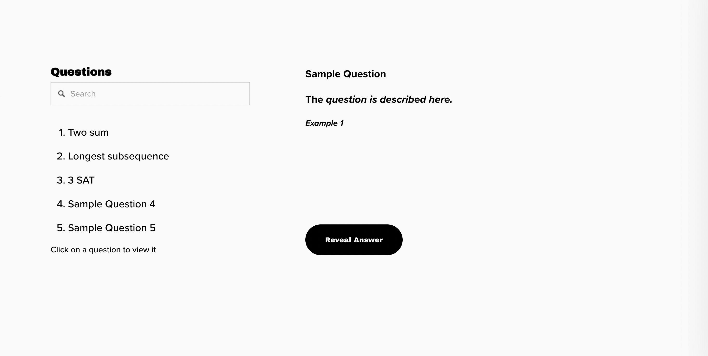
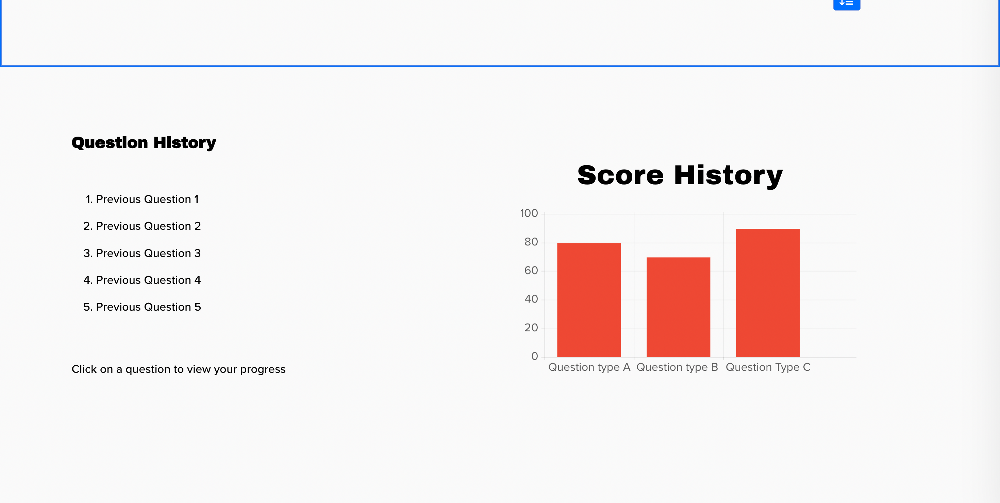

# https://quantready455.com/

# Definitions Page is still under construction: https://docs.google.com/document/d/1kVRQsiFZOgdsJ2s3lP6Y9rHdkdtSc79UYWn2BaY2TGs/edit?usp=sharing

# QuantReady
QuantReady is an interview preparation platform designed to help students excel in quantitative finance interviews. It offers a range of features and resources to enhance users' preparation and performance. The platform includes question banks, user profiles to track progress and an interactive comment feature for students to discuss their thoughts and solutions.

## Project Task Requirements

### Minimal Requirements (3-5)

1. **Practice Problems**
   - Person A creates a template of problems that are viewable in the frontend. (Done)
   - Person B sets up a database of questions in the backend. (Done)
   - Person C is responsible for linking the frontend with the backend and writing the APIs.(Done)

2. **View Correct Answers/Solutions**
   - Person A identifies the correct answers to the questions in the question bank. (Done)
   - Person B creates a way to match the user input to the correct result and output an appropriate message. (X)
   - Person C creates a way for users to view the correct solution. (Done)
3. **Profile**
   - The user should be able to create a profile. (Done)

### Standard Requirements (3-7)

1. **Role-based Access**
   - The platform should support multiple roles such as researchers and quant traders. (Done)

2. **View Correct Answers/Solutions**
   - Users should be able to view the correct answers/solutions. (Done)

3. **Question History**
   - The platform should display the user's history of attempted and unattempted questions. (Done, unattempted questions are implictly implied)

4. **Question Grouping**
   - Questions should be grouped based on levels of difficulty and topics. (Done)

### Stretch Requirements (2-3)

1. **Google Auth**
   - The platform should support Google authentication and have opportunities of supporting other authentication methods. (Done)

2. **User Community**
   - The platform should support a community of users with a commenting feature for discussion and collaboration. (Done)

3. **Interactive Learning Activities**
   - The platform may include interactive learning activities such as quizzes, mental math puzzles, and timed mock interviews. (X)

## Units 1-5 Tech Usage
1. ***Unit 1: HTML, CSS, JS***
   - Our components utilize MaterialUI, a React UI framework, combined with CSS to create a clean and modern look. HTML components are used through the application expliclty and implictly through MaterialUI and JSX to provide a hierarchy of components. JS is used throughout our application, namely frontend and backend application logic as well as handling user interactions.
2. ***Unit 2: React and Redux***
   - React powers our frontend, allowing us to create a dynamic and responsive user interface. We follow a component-based architecture, where the UI is broken down into smaller, reusable components, making it easier to manage and maintain our UI. Redux is used to manage the state of the user, allowing us to easily access user information throughout the application without additional backend API calls.
3. ***Unit 3: Node and Express***
   - Node and Express are used for our server to handle API calls, routes, middleware. This is used to create a RESTful API, which allows us to easily access and manipulate application related data from our database. Most notably, it's also used to handle user authentication and authorization by using the passport.js library and establishing user sessions with the cookie-session library.
4. ***Unit 4: MongoDB***
   -  MongoDB is used to store all application related data including user information, question banks, and user comments. We use Mongoose to create schemas and models for our data, allowing us to easily access and manipulate data from our database.
5. ***Unit 5: Builds and Deployment***
   - We use render.com to host our frontend and backend application using a custom domain name. By utilizing a subdomain for our backend application, we're able to set cookies storing the user's session information. Render.com is integrated with Github, allowing us to easily deploy our application everytime a change is merged into our main branch. 

## Above and Beyond Functionality
We believe that the Google Authentication and user profile feature is above and beyond the requirements of the project. This feature allows users to sign in with their Google account, which is a more secure and convenient way of signing in. This feature also allows us to easily implement other authentication methods in the future, such as Facebook and Github. We also encountered many challenges when implementing this feature, such as issues with setting user session cookies as initially our frontend and backend were deployed on different domains. The user profile allows users to view their progress and history, which is a useful feature for users to track their progress and performance. This feature also allows us to easily implement other features in the future, such as a leaderboard or employ a gamification approach to learning.

## Next Steps
   - Harnessing the user profile and a history of their completed questions, we would like to gamify our application more by adding a leaderboard and a point system, allowing users to compete with each other and motivate them to complete more questions. 
   - Add interactive learning activities such as quizzes, mental math puzzles, and timed mock interviews, allowing users to practice their skills in a more engaging and interactive way. 
   - Extend more features for our commenting system, such as upvoting and downvoting comments, and a way to report inappropriate comments, allowing users to engage in more meaningful discussions and collaborate with each other. 

## List of Contributions
   - Annie: I spearheaded the full stack development of creating questions endpoints, and constructing questions page to display different types of questions as well as the question admin page for admin to add, delete or update questions. Additionally, I contributed to creating the question schema.
   - Angad: I constructed the frontend to monitor user progress and played a role in developing components for the questions page. Additionally, I contributed to populating the database and established a script for streamlined database management in the future.
   - Armaghan: I contributed to the team in the following:
      - Coming up with the idea, and communicating with the team and external stakeholders such as the UBCTG. This also included collecting questions and ensuring they fulfill the required criteria.
      - Making the About Us page, redux implementation and the comment feature (endpoints + schema) on the questions page (Front End + Back End).
      - Helping in coordination and communication. Ensuring that everyone in the team was on the same page.
   - Steven: I did the setup for the technologies for each unit, bootstrapping the frontend, backend, database, handling deployments and configuring our custom domain name. I played the role of a PM and EM, coordinating the team, ensuring that we were on track with our deliverables and reviewing all PRs. I also contributed to the frontend and backend development, namely the user profile, navbar, all user related endpoints, and the Google authentication feature.
   - Yasser: I played a pivotal role in shaping the user experience by crafting the homepage, about page, and profile page designs. Beyond frontend development, I also created essential API endpoints for seamless retrieval of user data through Google Auth. By infusing interactive animations across the platform, I ensured a cohesive and polished visual identity, fostering a consistent, engaging, and user-friendly website environment.

## Note: Parts of the README.md are written with the help of GitHub Co-Pilot. 

## Prototype Sketches
### Homepage

### Questions Page

## Getting Started

To get started with QuantReady, follow the installation steps below:

1. Clone this repository: `git clone https://github.com/yourusername/quantready.git`
2. Install the necessary dependencies.
3. Set up the frontend and backend environments.
4. Configure the database.
5. Run the application.
6. Access the application via the provided URL.

For detailed instructions on installation and usage, refer to the documentation provided in the repository.

## Acknowledgements

The question banks used in QuantReady are created by the UBC Trading Group and our team. We would like to express our gratitude to the UBC Trading Group for their valuable contributions.

